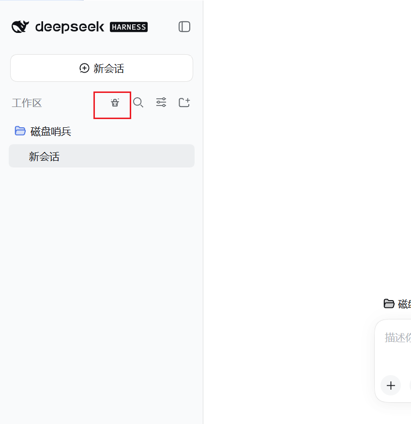
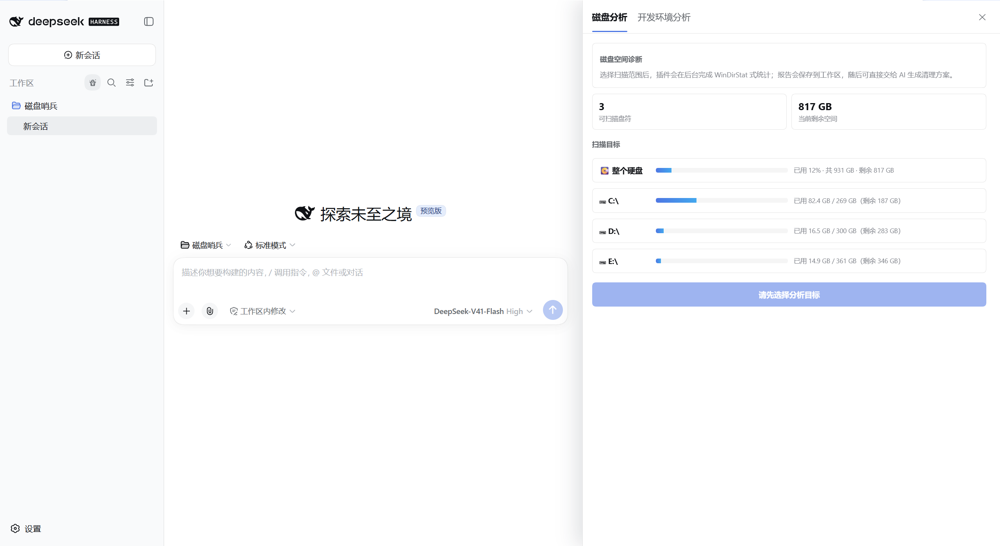
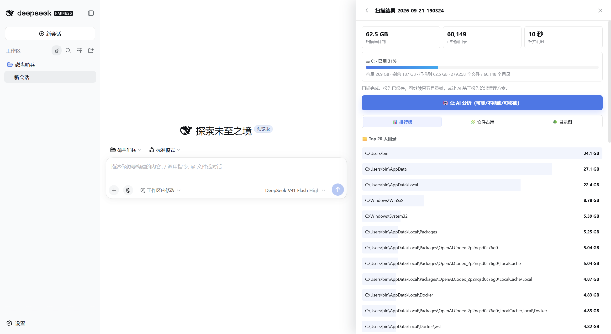
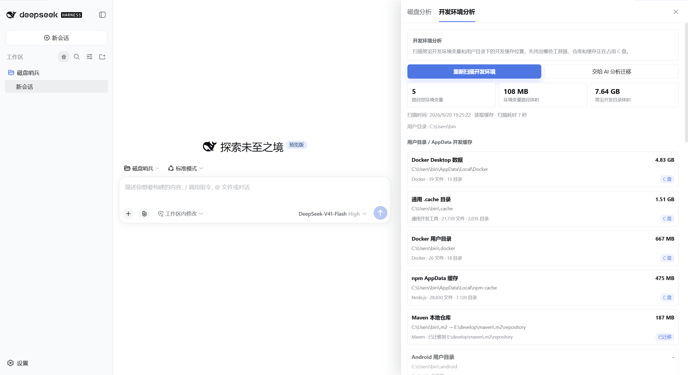

# DSH Disk Sentinel / 磁盘哨兵


DeepSeek Harness 的 Windows 磁盘分析与安全清理插件。安装后会在 DSH Web UI 中增加
“磁盘哨兵”入口，提供可视化磁盘扫描、软件占用排名、历史差量、AI 清理建议与开发环境迁移。

> 本项目是社区维护的非官方插件，与 DeepSeek AI 无隶属关系。

磁盘哨兵把磁盘扫描、报告、空间预估、用户确认和清理收敛为稳定工具与可视化面板，避免 AI Agent 临时生成大量 `dir`、`Get-ChildItem` 命令逐层扫描。这样既能减少耗时与 token 消耗，也让清理和迁移过程更容易审计。

## 核心能力

| 能力 | 说明 |
| --- | --- |
| `disk_scan` | WinDirStat 风格目录扫描，一次返回目录树、Top 大目录、Top 大文件和耗时 |
| `clean_disk` | 预定义垃圾类别清理，支持 `list`、`estimate`、`clean` 三段式流程 |
| `dev_env_migrate` | 为最近一次开发环境扫描中的目录生成一次性迁移计划，并在用户确认后执行 |
| 磁盘分析 | 在 DSH Web UI 中选择磁盘、后台扫描、取消任务、查看容量与目录占用 |
| 软件占用排名 | 从真实扫描结果中识别常见安装目录、用户数据和游戏库，展示 Top 10，并按应用跨盘聚合 |
| 扫描报告 | 保存扫描报告并以 `@文件` 引用发送给当前会话，让 AI 基于真实结果分析 |
| 历史差量 | 对比两次扫描报告，查看新增、消失、增长和缩小的目录 |
| 开发环境分析 | 扫描路径型环境变量与常见开发缓存，识别真实生效路径并提供安全迁移入口 |

## 界面预览

### 插件入口



### 磁盘分析



### 扫描结果



### 开发环境分析



## 安全设计

清理工具遵循固定流程：

```text
list -> estimate -> 用户确认 -> clean
```

`estimate` 只预估空间，不删除文件；`clean` 才会执行不可逆清理。Web 面板的全盘扫描通过 `/disk-sentinel` RPC 通道直连宿主，不经过 LLM，也不需要在提示词中指定底层扫描命令。

插件会保护磁盘哨兵工作区目录，避免删除扫描报告等 DSH 自身运行数据。

开发环境迁移会重新校验扫描来源、系统保护目录、源目录、目标盘和持久配置状态。目标必须位于其他磁盘，并至少保留源目录体积 105% 的可用空间。空目标目录可以直接使用；目标目录已有内容时必须二次确认，原内容会先整体备份再由迁移内容替换。执行时先复制并校验数据，再切换配置；成功后原目录会改名保留为备份，失败时会尝试恢复配置和源、目标目录。

## 预定义清理类别

| ID | 名称 | 说明 |
| --- | --- | --- |
| `windows_temp` | Windows 临时文件 | `%TEMP%`、`%TMP%`、`C:\Windows\Temp` |
| `windows_prefetch` | Windows 预读取 | `C:\Windows\Prefetch` |
| `windows_update_cache` | Windows 更新缓存 | `C:\Windows\SoftwareDistribution\Download` |
| `recycle_bin` | 回收站 | 通过 Shell COM 对象清空 |
| `npm_cache` | npm 缓存 | `npm cache clean --force` |
| `pnpm_store` | pnpm store | `%LOCALAPPDATA%\pnpm-store` |
| `yarn_cache` | Yarn 缓存 | `yarn cache clean` |
| `pip_cache` | pip 缓存 | `pip cache purge` |
| `thumbnail_cache` | 缩略图缓存 | `thumbcache_*.db`、`iconcache_*.db` |
| `windows_logs` | Windows 日志 | `C:\Windows\Logs`、`C:\Windows\Panther` |
| `memory_dumps` | 内存转储 | `C:\Windows\Minidump`、`MEMORY.DMP` |
| `edge_cache` | Edge 浏览器缓存 | `Cache`、`Code Cache` |
| `chrome_cache` | Chrome 浏览器缓存 | `Cache`、`Code Cache` |
| `delivery_optimization` | 传递优化缓存 | Windows P2P 更新分发缓存 |
| `dns_cache` | DNS 客户端缓存 | `ipconfig /flushdns` |

## 安装

### 从 GitHub 安装（推荐）

前置要求：Windows 系统，并已安装 DeepSeek Harness（`dsh`）。

```powershell
dsh plugin --profile web add git+https://github.com/wee-b/disk-sentinel.git
dsh web
```

仓库已提交构建后的浏览器端文件，从 GitHub 安装不需要另外安装 pnpm 或执行构建。
启动 DSH 后，侧边栏设置区域附近会出现 **磁盘哨兵** 入口。

### 更新

使用最新版源码重新安装：

```powershell
dsh plugin --profile web remove @dsh-plugin/disk-sentinel
dsh plugin --profile web add git+https://github.com/wee-b/disk-sentinel.git
dsh web
```

### 卸载

```powershell
dsh plugin --profile web remove @dsh-plugin/disk-sentinel
```

卸载插件不会自动删除已经生成的本地扫描报告。如需手动清理报告，可在确认不再需要后删除：

```text
%TEMP%\磁盘哨兵
```

### 从源码开发安装

开发环境需要：

- Windows 系统
- 已安装 DeepSeek Harness（`dsh`）
- 已安装 pnpm

克隆仓库后执行：

```powershell
git clone https://github.com/wee-b/disk-sentinel.git
cd disk-sentinel
pnpm install
pnpm run build:client
dsh plugin --profile web add .
```

## Windows pnpm link 手动安装

如果 `dsh plugin add` 在 Windows 上创建了错误的 pnpm junction，可以手动编辑 `%USERPROFILE%\.dsh\profiles\web\package.json`：

```json
{
  "name": "dsh-profile-web",
  "private": true,
  "dependencies": {
    "@dsh-plugin/disk-sentinel": "link:E:/develop/projects/nodequanzhan/dsh-plugin"
  },
  "dsh": {
    "profile": {
      "bundles": [
        "@deepseek-ai/dsh-base",
        "@deepseek-ai/dsh-web-app",
        "@dsh-plugin/disk-sentinel"
      ]
    }
  }
}
```

然后执行：

```powershell
cd %USERPROFILE%\.dsh\profiles\web
pnpm install
dsh --profile web --dump-config | findstr disk-sentinel
dsh web
```

## 兼容性

| 项目 | 支持情况 |
| --- | --- |
| 操作系统 | Windows；当前版本使用 PowerShell、盘符和 Windows 用户环境变量，不支持 macOS/Linux |
| DSH Profile | `web` |
| 已验证 DSH 版本 | `0.1.5-rc.2` |
| 已验证 Node.js 版本 | `24.21.0` |
| 网络服务 | 插件自身不连接外部服务；AI 分析使用用户在 DSH 中配置的模型提供方 |
| 遥测 | 无遥测、无使用数据收集 |

较新的 DSH 版本通常也可使用，但如果宿主的插件 RPC 或工作区 API 发生不兼容变更，请提交
[Issue](https://github.com/wee-b/disk-sentinel/issues) 并附上 DSH 版本与错误日志。

## 权限、数据与风险说明

插件只在用户主动操作时执行扫描、清理或迁移：

- **磁盘读取**：扫描用户选择的盘符，读取目录结构、文件大小和修改时间；无法访问的目录会跳过，不会为了扫描自动提权。
- **本地写入**：扫描报告、差量报告和迁移分析保存在 `%TEMP%\磁盘哨兵`。
- **删除操作**：只有 `clean_disk` 的 `clean` 模式会删除数据；推荐固定遵循 `list → estimate → 用户确认 → clean`。
- **进程调用**：使用 PowerShell 或系统命令读取磁盘容量、执行预定义缓存清理、打开目录选择器和修改受支持的开发工具配置。
- **配置修改**：开发环境迁移在用户确认后可能修改工具配置文件或专用的 Windows 用户环境变量，但不会修改系统 `Path`。
- **AI 数据边界**：普通磁盘扫描不经过 LLM；只有用户点击“让 AI 分析”或主动引用报告时，报告中的本地路径和空间统计才会交给 DSH 当前配置的模型提供方处理。

清理与迁移属于高影响操作。请先查看预估和计划，确认路径、目标盘和备份状态；重要数据应另有备份。

## 使用方式

### 磁盘分析

扫描结果页包含“软件占用”页签，默认展示占用最大的 10 个应用。应用的安装目录、
用户 AppData、ProgramData、WindowsApps、Steam/Epic 游戏库以及常见便携软件目录会按
规范化名称合并；同一应用分布在多个盘时，会展示跨盘合计与各盘明细。该排名属于基于
目录归属的估算，共享运行库或自定义安装目录可能无法准确归属；选择“全部磁盘”扫描可获得
完整的跨盘统计。

1. 选择目标磁盘或整个硬盘。
2. 点击开始分析；扫描期间会实时展示已扫描目录数、当前路径和耗时，也可以随时取消。
3. 查看容量统计、Top 大目录和 Top 大文件，或选择两份历史报告生成差量报告。
4. 点击让 AI 分析，当前会话会收到扫描报告的 `@文件` 引用。AI 可以据此给出“可安全删除、不要动、适合迁移、建议清理顺序”等建议。

在对话中也可以直接让 Agent 使用工具：

```text
帮我分析一下 C 盘空间，并在确认后清理可安全删除的缓存。
```

推荐先调用 `clean_disk` 的 `list` 和 `estimate`，明确预计删除范围，再由用户确认是否执行 `clean`。

### 开发环境分析

进入开发环境分析页后会自动扫描路径型开发环境变量，以及用户目录和 AppData 中的常见开发缓存。24 小时内默认优先使用工作区缓存；点击“重新扫描开发环境”会跳过缓存并重新统计。

真实扫描期间页面会持续展示：

- 已扫描文件数
- 已扫描目录数
- 已统计路径数
- 当前扫描路径
- 已用时间

文件数和目录数使用平滑数字动画追随后台实时计数；动画过程可能跳过中间整数，但扫描完成后的最终值以实际统计结果为准。只有真实扫描才展示这段进度，从缓存读取结果时不会伪造扫描动画。

`Path`、`SystemRoot`、`ProgramFiles`、`TEMP` 等 Windows 通用变量位于本地黑名单中，不展示也不扫描。常见开发目录会同时检查默认路径、受支持的工具配置和专用环境变量；如果工具已经迁移，页面会显示“默认路径 → 当前生效路径”，统计当前生效目录的体积并标记“已迁移”。

手动迁移入口按工具的持久化方式处理：

| 工具或目录 | 迁移后修改内容 |
| --- | --- |
| Maven 本地仓库 | `settings.xml` 的 `localRepository` |
| npm 缓存 | 用户级 `.npmrc` 的 `cache` |
| pnpm store | pnpm 配置中的 `store-dir` |
| Yarn 缓存 | Yarn 配置中的缓存目录 |
| Go 工作区 | Go 持久配置中的 `GOPATH` |
| NuGet 包缓存 | `NuGet.Config` 的 `globalPackagesFolder` |
| Gradle 缓存 | Windows 用户环境变量 `GRADLE_USER_HOME` |
| Cargo 缓存 | Windows 用户环境变量 `CARGO_HOME` |
| Rustup 工具链 | Windows 用户环境变量 `RUSTUP_HOME` |
| Android 用户目录 | Windows 用户环境变量 `ANDROID_USER_HOME` |

因此，迁移并不是只复制文件：配置文件型目录会修改对应工具配置，环境变量型目录会修改对应的 Windows 用户环境变量。插件不会把所有迁移都统一改成环境变量，也不会修改系统 `Path`。

页面只有在源目录存在，并且受支持的持久配置可解析、可写或存在专用用户环境变量时，才显示“迁移”按钮。没有手动入口的扫描目录可以交给 AI 分析；AI 仍需先通过 `dev_env_migrate` 生成计划，用户明确确认后才能执行。迁移完成后应重启终端和 IDE，确认工具使用新目录，再自行处理原目录备份。

每次生成新的开发环境迁移分析报告后，只保留最新的 `开发环境迁移分析-*.md`，并自动删除旧报告和 `开发环境分析.json` 扫描缓存；磁盘扫描与差量报告不受影响。

## 已知限制

- 软件占用排名是基于常见安装目录、AppData、ProgramData、WindowsApps 和游戏库的目录归属估算，不等同于 Windows“已安装的应用”统计。
- 共享运行库、自定义安装目录、硬链接、稀疏文件以及厂商复用目录可能导致应用归属或占用值存在偏差。
- 只扫描单个盘符时，软件排名只反映该盘；需要跨盘合计时请选择“整个硬盘”。
- 受权限保护或被其他进程占用的路径可能无法扫描或清理；插件会跳过并保留错误信息。
- `%TEMP%` 可能被系统或清理工具清空，重要报告请及时另行保存。

## 配置

| 配置项 | 默认值 | 说明 |
| --- | ---: | --- |
| `scanTimeoutMs` | 300000 | 磁盘扫描超时，默认 5 分钟 |
| `cleanTimeoutMs` | 120000 | 清理超时，默认 2 分钟 |
| `migrationTimeoutMs` | 1800000 | 开发环境目录迁移超时，默认 30 分钟 |
| `maxDepth` | 8 | 工具默认递归深度 |
| `topDirsCount` | 30 | 返回的 Top 目录数 |
| `topFilesCount` | 50 | 返回的 Top 文件数 |
| `treeRenderMaxNodes` | 200 | 树形文本最大渲染节点数 |

## 开发

构建浏览器客户端：

```sh
pnpm run build:client
```

运行核心检查：

```sh
node test/scan-test.mjs
node test/clean-estimate-test.mjs
node test/report-test.mjs
node test/diff-test.mjs
node test/folder-picker-test.mjs
node test/dev-env-scan-job-test.mjs
node test/dev-env-migration-test.mjs
node test/dev-env-var-blacklist-test.mjs
node test/dev-env-path-blacklist-test.mjs
node test/layout-test.mjs
node test/chat-interaction-test.mjs
node test/application-ranking-test.mjs
```

## 反馈与贡献

- 问题反馈：[GitHub Issues](https://github.com/wee-b/disk-sentinel/issues)
- 源码仓库：[wee-b/disk-sentinel](https://github.com/wee-b/disk-sentinel)
- 提交修改前请运行与改动相关的测试，并重新执行 `pnpm run build:client` 提交最新的 `lib/client.js`。

## 许可证

[MIT](LICENSE)
